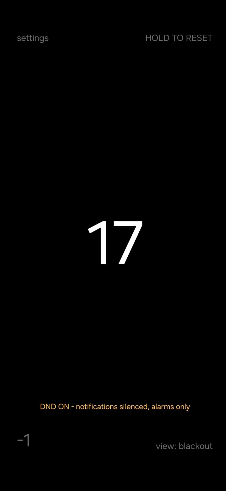
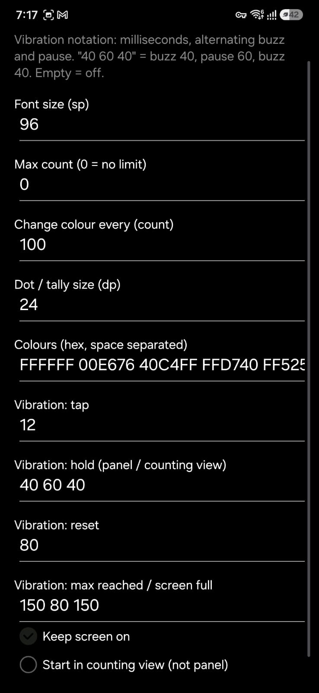
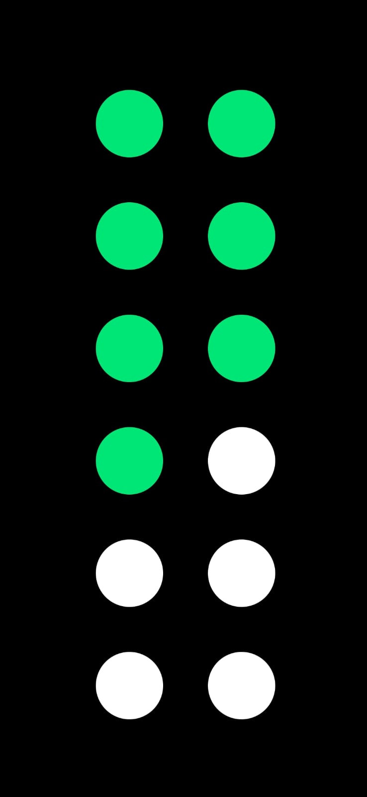
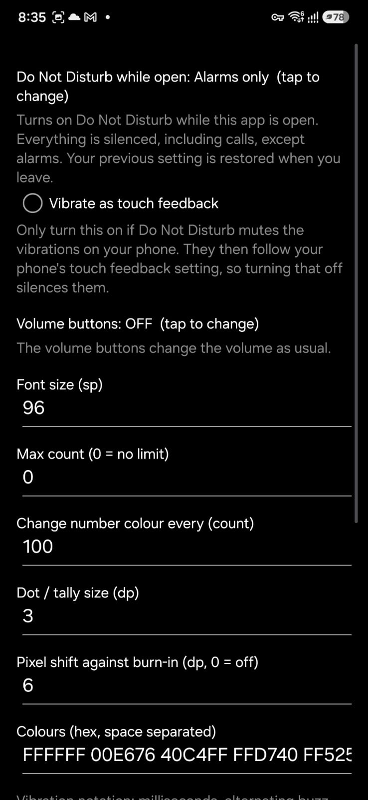

# weecounter

> **AI disclosure:** this app was written with AI-assisted coding (Claude by Anthropic). I direct the design, review the code and test it on my own device.

A tiny tap counter for AMOLED screens. Pure Java, no libraries, no network, tiny APK.

<p>
  
  
  
  
  
  
  
  
</p>

(yes the third screenshot is a feature, you can count with ur screen off ish on amoled displays)

## Use

- **Tap** anywhere: count up, short vibration.
- **Hold** anywhere: switch between the panel (number and buttons) and the counting view.
- **Panel:** `-1` bottom left, `HOLD TO RESET` top right, `settings` top left, `view` bottom right cycles the counting view.
- **Counting views:** blackout (pure black), dots, tally. Dots and tally take the number's colour: they fill one mark per tap, then drain one mark per tap (earliest first) until the next lap (every 100 by default), which changes the colour, buzzes and starts over. Counting never stops; an optional "count reached" target buzzes once when you hit it.
- **Volume buttons** (optional, off by default): count with the volume keys, e.g. both add one, or up adds and down subtracts. Set in settings.
- **Vibration patterns** are plain milliseconds, alternating buzz and pause: `40 60 40` = buzz 40, pause 60, buzz 40. Empty = off.

The display drifts a few pixels every 15 seconds to protect AMOLED screens from burn-in (configurable, can be turned off).

Optional (off by default): turn on Do Not Disturb while the app is open, either "priority only" or "alarms only". The previous setting is restored when you leave. Needs Do Not Disturb access, which you grant in Android's settings.

## Dhikr profiles

Optional (settings, "Dhikr profile"). A profile is a UTF-8 text file, one file per profile, any language. A line like `---33` starts a slide that is counted 33 times (`0` skips it, `1` shows it once). The lines below it, up to the next `---N` line (or a bare `---`), are shown above the number.

```
---33
[70]Arabic text
[30]Subhanallah
---33
[30]Arabic | [20]Transliteration | [40]Meaning
[_]always shown, takes what is left
---1
[10]
[100]the end
```

- `[70]` in front of a line gives it a share of the text area, and the text is fitted into its share. `[_]` (or `[*]`) takes whatever is left of 100, `[10]` alone on a line is an empty spacer, `[]` hides a line. Lines without a prefix get the average share of the numbered ones (equal if none has one). Blank lines are dropped.
- `|` writes alternative views of a line. A slide with `A | B | C` has three views: view 1 shows A, view 2 shows B, view 3 shows C, while lines without `|` stay on screen in every view.
- The number shows `17/33`, with `slide 2 of 4` under it. A finished slide gives the lap buzz (the tap buzz if its count is 1); the last tap gives the "count reached" buzz and a completed screen with confetti.
- Gestures: swipe **left** to pull in the next slide (counts as done), **right** to go back to the previous one, **up** / **down** to switch between the views of a slide.
- A line `# Title` inside a slide names it in the slide list (hold the dhikr text to open it and jump to a slide; tap the profile name at the top of the list to switch profile). Without a title, the start of the slide's first line is used.
- A slide that is counted once shows a ring instead of `0/1`.
- Profiles are `.dhikr` files. Share one to weecounter from any app (for example WhatsApp's share sheet) to import it without opening the app first; pasted text works too if its first line is `# Name`. Tapping a `.dhikr` file in WhatsApp lists weecounter under "Open with" too (WhatsApp calls the file type BIN); files that are not profiles are ignored.
- On the completed screen, tap once (a toast asks "Tap again to start over") and again within 4 seconds to restart the profile. `-1` goes back and hold-to-reset also starts over. Import, export and delete profiles on the profile screen (hold the red x to delete).

## Build

```
./gradlew assembleRelease
```

CI builds are in `.github/workflows` (`test.yml` for a test APK, `release.yml` for tagged releases). Releases are signed with the author's key; the F-Droid build is signed by F-Droid, so the two cannot update each other.

## License

GPL-3.0, see [LICENSE](LICENSE).
